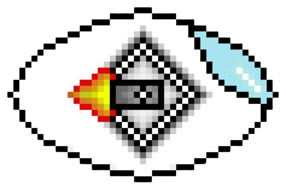
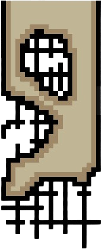
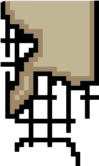
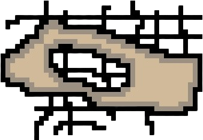
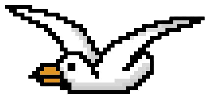
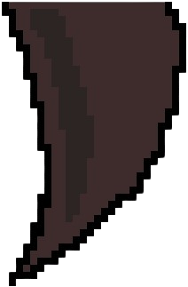

#  **LYNX**
## Trabalho feito em Âmbito da Disciplina de Design Multimédia
### **Descrição**

Durante a segunda metade do século XXI, a Terra viveu um período de rápido crescimento populacional, que colocou pressão sobre o abastecimento global de alimentos e energia. Este fenómeno causou com os governos nacionais ficassem sobrecarregados com a necessidades das suas populações e acelerassem a extração de recursos naturais e fontes de energia extremamente poluentes de forma a não causar um colapso das suas sociedades. No entanto, estas ações apenas causaram mais conflitos e esgotar a maioria dos recursos naturais disponíveis no planeta, o que por si causou um dominó de eventos que levaram ao colapso da vida na terra como a conhecemos.

Uma dos únicos refúgios que conseguiram sobrevier a este colaspo foi uma colónia de na penísula de Anatólia, onde o Professor Jarnefeldt, um cientísta de renome que fugiu da Alemanha antes deste se dissolver e quebrar-se em estados de senhores de guerra, bem como vários dos seus colegas, tornaram Fethyie (localidade costeira na antiga Turquia) num dos únicos lugares de relativa segurança e normalidade na Terra.

Numa tentativa desesperada para preservar o planeta Terra da sua extinção, Jarnefeldt e a sua equipa de engenheiros construiu uma pequena nave “LYNX” controlada por I.A., para explorar a Terra inóspita à procura de ambientes terrestres que sobreviveram à enorme poluição espalhada pelo planeta, bem como artefactos históricos que ainda estejam intactos para preservar a história da humanidade. 

O objetivo do jogo é atravessar estes ambientes com a unidade “LYNX” sem com que ela bata em nenhum obstáculo, de forma a recolher data nos vários ambientes até preencher uma barra de “Coleção de Data”. Caso contrário, perderá toda a data recolhida e a nave “LYNX” ficará inoperacional e será também perdida pela equipa do Professor Jarnefeldt.

### Imagem de Marca

### Perfil do Jogador/Personagem Principal

### Obstáculos	

### Situações de Jogo

### Link do Jogo 	
[LYNX](https://www.example.com) (Soon + 2 Weeks)

### Trailer
Soon + 2 weeks

